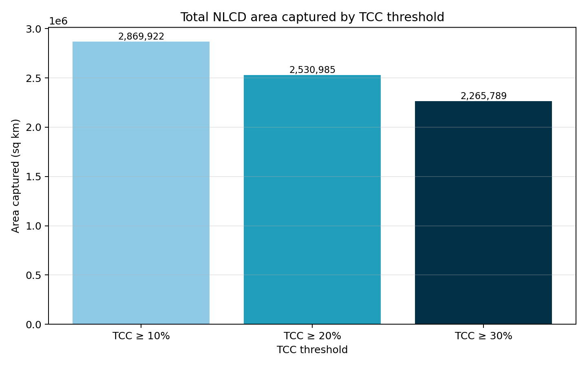
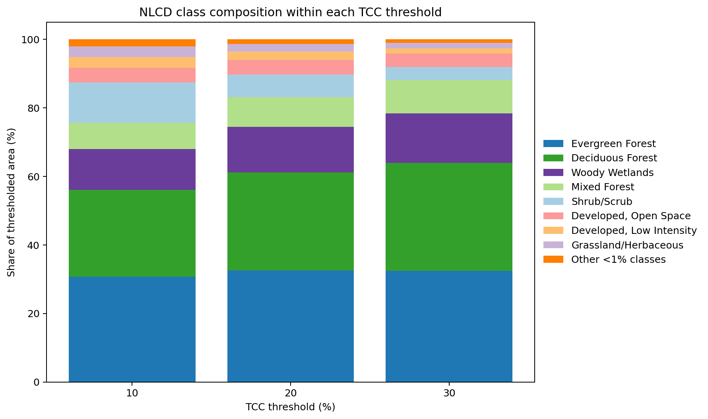
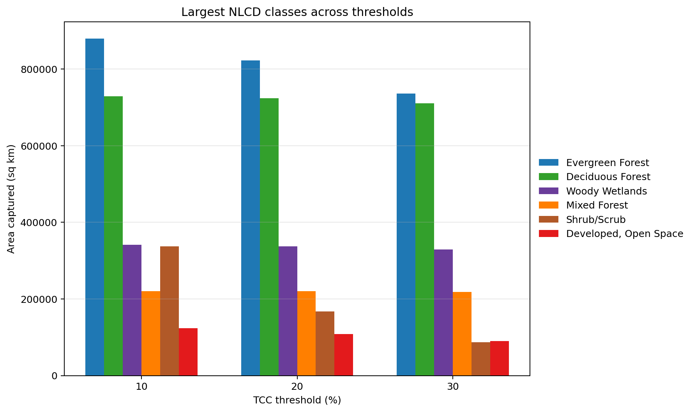

# NLCD 2024 x TCC 2023 Threshold Report

## Overview

This report summarizes the overlay of **Annual NLCD 2024 land cover** with **NLCD Tree Canopy Cover 2023** using cumulative canopy thresholds of **10%**, **20%**, and **30%**. For each threshold, the workflow:

1. keeps NLCD pixels where **TCC >= threshold**,
2. writes a masked NLCD raster, and
3. summarizes the NLCD class composition inside the retained area.

**TCC definition used here:** percent of each 30 m pixel covered by tree canopy, with threshold masks interpreted cumulatively (for example, **TCC >= 10%** means all pixels from 10 to 100 percent canopy cover).

## Key takeaways

- The total mapped area drops from **2,869,922.1 sq km** at **TCC >= 10%** to **2,530,985.2 sq km** at **TCC >= 20%** and **2,265,788.8 sq km** at **TCC >= 30%**.
- The dominant class at **TCC >= 10%** is **Evergreen Forest** at **30.65%** of the retained area.
- The dominant class at **TCC >= 30%** is **Evergreen Forest** at **32.49%** of the retained area.
- As thresholds rise, the retained landscape becomes more concentrated in **forest and woody wetland classes**, while **shrub/scrub, grassland/herbaceous, and developed classes** lose share and area.
- These outputs are best interpreted as a **descriptive overlay** rather than an independent validation test, because the NLCD TCC product is post-processed with some NLCD-derived masks.

## Threshold area summary

| threshold_label | total_area_sqkm | change_from_10_sqkm | change_from_10_percent |
| --------------- | --------------- | ------------------- | ---------------------- |
| TCC ≥ 10%      | 2,869,922.1     | 0.0                 | +0.0%                  |
| TCC ≥ 20%      | 2,530,985.2     | -338,936.9          | -11.8%                 |
| TCC ≥ 30%      | 2,265,788.8     | -604,133.3          | -21.1%                 |

## Graphics

### Total area retained by threshold

### NLCD composition within each threshold

### Largest classes across thresholds

## Top classes within each threshold

| Threshold  | NLCD class            | Area (sq km) | Share  |
| ---------- | --------------------- | ------------ | ------ |
| TCC ≥ 10% | Evergreen Forest      | 879,692.9    | 30.65% |
| TCC ≥ 10% | Deciduous Forest      | 728,647.3    | 25.39% |
| TCC ≥ 10% | Woody Wetlands        | 341,126.3    | 11.89% |
| TCC ≥ 10% | Shrub/Scrub           | 337,642.7    | 11.76% |
| TCC ≥ 10% | Mixed Forest          | 220,705.6    | 7.69%  |
| TCC ≥ 20% | Evergreen Forest      | 822,898.8    | 32.51% |
| TCC ≥ 20% | Deciduous Forest      | 723,553.4    | 28.59% |
| TCC ≥ 20% | Woody Wetlands        | 337,233.9    | 13.32% |
| TCC ≥ 20% | Mixed Forest          | 220,076.2    | 8.70%  |
| TCC ≥ 20% | Shrub/Scrub           | 167,470.6    | 6.62%  |
| TCC ≥ 30% | Evergreen Forest      | 736,142.1    | 32.49% |
| TCC ≥ 30% | Deciduous Forest      | 710,530.0    | 31.36% |
| TCC ≥ 30% | Woody Wetlands        | 329,293.8    | 14.53% |
| TCC ≥ 30% | Mixed Forest          | 218,181.5    | 9.63%  |
| TCC ≥ 30% | Developed, Open Space | 89,766.0     | 3.96%  |

## Selected class change from 10% to 30%

| NLCD class           | 10% area (sq km) | 30% area (sq km) | Change (sq km) | Change (%) |
| -------------------- | ---------------- | ---------------- | -------------- | ---------- |
| Deciduous Forest     | 728,647.3        | 710,530.0        | -18,117.3      | -2.5%      |
| Evergreen Forest     | 879,692.9        | 736,142.1        | -143,550.9     | -16.3%     |
| Grassland/Herbaceous | 87,811.6         | 36,680.3         | -51,131.3      | -58.2%     |
| Mixed Forest         | 220,705.6        | 218,181.5        | -2,524.0       | -1.1%      |
| Shrub/Scrub          | 337,642.7        | 86,817.1         | -250,825.6     | -74.3%     |
| Woody Wetlands       | 341,126.3        | 329,293.8        | -11,832.5      | -3.5%      |

## Deliverables

### Rasters

- `outputs/rasters/nlcd_2024_tcc2023_gte_10.tif`
- `outputs/rasters/nlcd_2024_tcc2023_gte_20.tif`
- `outputs/rasters/nlcd_2024_tcc2023_gte_30.tif`

### Tables

- `outputs/tables/nlcd_tcc_threshold_10_summary.csv`
- `outputs/tables/nlcd_tcc_threshold_20_summary.csv`
- `outputs/tables/nlcd_tcc_threshold_30_summary.csv`
- `outputs/tables/nlcd_tcc_threshold_comparison.csv`

### Report assets

- `outputs/report_assets/total_area_by_threshold.png`
- `outputs/report_assets/composition_stacked_percent.png`
- `outputs/report_assets/key_classes_area.png`
